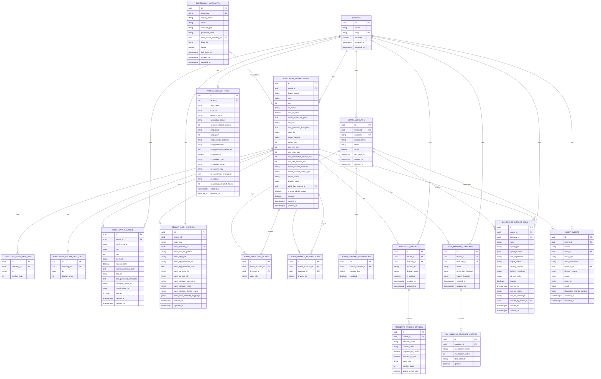

# Database Entity Relationship Diagram

```mermaid
erDiagram
    TENANTS {
        uuid id PK
        string name
        string slug UK
        boolean enabled
        timestamptz created_at
        timestamptz updated_at
    }

    SUPERADMIN_ACCOUNTS {
        uuid id PK
        string username UK
        string display_name
        string email
        string account_type
        string password_hash
        uuid ldap_source_directory_id FK
        string ldap_dn
        boolean active
        timestamptz last_login_at
        timestamptz created_at
        timestamptz updated_at
    }

    DIRECTORY_CONNECTIONS {
        uuid id PK
        uuid tenant_id FK
        string display_name
        string host
        int port
        string ssl_mode
        boolean trust_all_certs
        text trusted_certificate_pem
        string bind_dn
        text bind_password_encrypted
        string base_dn
        string object_classes
        int paging_size
        int pool_min_size
        int pool_max_size
        int pool_connection_timeout_ms
        int pool_idle_timeout_ms
        string enable_disable_attribute
        string enable_disable_value_type
        string enable_value
        string disable_value
        uuid audit_data_source_id FK
        boolean is_superadmin_source
        boolean enabled
        timestamptz created_at
        timestamptz updated_at
    }

    DIRECTORY_USER_BASE_DNS {
        uuid id PK
        uuid directory_id FK
        string dn
        int display_order
    }

    DIRECTORY_GROUP_BASE_DNS {
        uuid id PK
        uuid directory_id FK
        string dn
        int display_order
    }

    AUDIT_DATA_SOURCES {
        uuid id PK
        uuid tenant_id FK
        string display_name
        string host
        int port
        string ssl_mode
        boolean trust_all_certs
        text trusted_certificate_pem
        string bind_dn
        text bind_password_encrypted
        string changelog_base_dn
        string branch_filter_dn
        boolean enabled
        timestamptz created_at
        timestamptz updated_at
    }

    TENANT_AUTH_CONFIGS {
        uuid id PK
        uuid tenant_id FK
        string auth_type
        uuid ldap_directory_id FK
        string ldap_bind_dn_pattern
        string saml_idp_type
        string saml_idp_metadata_url
        text saml_idp_metadata_xml
        string saml_sp_entity_id
        string saml_sp_acs_url
        string saml_attribute_username
        string saml_attribute_email
        string saml_attribute_display_name
        jsonb saml_extra_attribute_mappings
        timestamptz created_at
        timestamptz updated_at
    }

    ADMIN_ACCOUNTS {
        uuid id PK
        uuid tenant_id FK
        string username UK
        string display_name
        string email
        boolean active
        timestamptz last_login_at
        timestamptz created_at
        timestamptz updated_at
    }

    ADMIN_DIRECTORY_ROLES {
        uuid id PK
        uuid admin_account_id FK
        uuid directory_id FK
        string base_role
    }

    ADMIN_BRANCH_RESTRICTIONS {
        uuid id PK
        uuid admin_account_id FK
        uuid directory_id FK
        string branch_dn
    }

    ADMIN_FEATURE_PERMISSIONS {
        uuid id PK
        uuid admin_account_id FK
        string feature_key
        boolean enabled
    }

    ATTRIBUTE_PROFILES {
        uuid id PK
        uuid tenant_id FK
        uuid directory_id FK
        string branch_dn
        string display_name
        boolean is_default
        timestamptz created_at
        timestamptz updated_at
    }

    ATTRIBUTE_PROFILE_ENTRIES {
        uuid id PK
        uuid profile_id FK
        string attribute_name
        string custom_label
        boolean required_on_create
        boolean enabled_on_edit
        string input_type
        int display_order
        boolean visible_in_list_view
    }

    CSV_MAPPING_TEMPLATES {
        uuid id PK
        uuid tenant_id FK
        uuid directory_id FK
        string name
        string target_key_attribute
        string conflict_handling
        timestamptz created_at
        timestamptz updated_at
    }

    CSV_MAPPING_TEMPLATE_ENTRIES {
        uuid id PK
        uuid template_id FK
        string csv_column_name
        int csv_column_index
        string ldap_attribute
        boolean ignored
    }

    SCHEDULED_REPORT_JOBS {
        uuid id PK
        uuid tenant_id FK
        uuid directory_id FK
        string name
        string report_type
        jsonb report_params
        string cron_expression
        string output_format
        string delivery_method
        string delivery_recipients
        string s3_key_prefix
        boolean enabled
        timestamptz last_run_at
        string last_run_status
        string last_run_message
        uuid created_by_admin_id FK
        timestamptz created_at
        timestamptz updated_at
    }

    APPLICATION_SETTINGS {
        uuid id PK
        uuid tenant_id FK
        string app_name
        string logo_url
        string primary_colour
        string secondary_colour
        int session_timeout_minutes
        string smtp_host
        int smtp_port
        string smtp_sender_address
        string smtp_username
        text smtp_password_encrypted
        boolean smtp_use_tls
        string s3_endpoint_url
        string s3_bucket_name
        string s3_access_key
        text s3_secret_key_encrypted
        string s3_region
        int s3_presigned_url_ttl_hours
        timestamptz created_at
        timestamptz updated_at
    }

    AUDIT_EVENTS {
        uuid id PK
        uuid tenant_id FK
        string source
        uuid actor_id FK
        string actor_type
        string actor_username
        uuid directory_id FK
        string directory_name
        string action
        string target_dn
        jsonb detail
        bigint changelog_change_number
        timestamptz occurred_at
        timestamptz recorded_at
    }

    %% Relationships
    TENANTS ||--o{ DIRECTORY_CONNECTIONS : "has"
    TENANTS ||--o{ AUDIT_DATA_SOURCES : "has"
    TENANTS ||--|| TENANT_AUTH_CONFIGS : "has"
    TENANTS ||--o{ ADMIN_ACCOUNTS : "has"
    TENANTS ||--o{ ATTRIBUTE_PROFILES : "has"
    TENANTS ||--o{ CSV_MAPPING_TEMPLATES : "has"
    TENANTS ||--o{ SCHEDULED_REPORT_JOBS : "has"
    TENANTS ||--o| APPLICATION_SETTINGS : "has"
    TENANTS ||--o{ AUDIT_EVENTS : "has"

    DIRECTORY_CONNECTIONS ||--o{ DIRECTORY_USER_BASE_DNS : "has"
    DIRECTORY_CONNECTIONS ||--o{ DIRECTORY_GROUP_BASE_DNS : "has"
    DIRECTORY_CONNECTIONS |o--o| AUDIT_DATA_SOURCES : "uses"
    DIRECTORY_CONNECTIONS ||--o{ ADMIN_DIRECTORY_ROLES : "scopes"
    DIRECTORY_CONNECTIONS ||--o{ ADMIN_BRANCH_RESTRICTIONS : "scopes"
    DIRECTORY_CONNECTIONS ||--o{ ATTRIBUTE_PROFILES : "has"
    DIRECTORY_CONNECTIONS ||--o{ CSV_MAPPING_TEMPLATES : "has"
    DIRECTORY_CONNECTIONS ||--o{ SCHEDULED_REPORT_JOBS : "has"
    DIRECTORY_CONNECTIONS }o--o| TENANT_AUTH_CONFIGS : "used by"

    SUPERADMIN_ACCOUNTS }o--o| DIRECTORY_CONNECTIONS : "sourced from"

    ADMIN_ACCOUNTS ||--o{ ADMIN_DIRECTORY_ROLES : "has"
    ADMIN_ACCOUNTS ||--o{ ADMIN_BRANCH_RESTRICTIONS : "has"
    ADMIN_ACCOUNTS ||--o{ ADMIN_FEATURE_PERMISSIONS : "has"
    ADMIN_ACCOUNTS ||--o{ SCHEDULED_REPORT_JOBS : "created"
    ADMIN_ACCOUNTS ||--o{ AUDIT_EVENTS : "generates"

    ATTRIBUTE_PROFILES ||--o{ ATTRIBUTE_PROFILE_ENTRIES : "contains"
    CSV_MAPPING_TEMPLATES ||--o{ CSV_MAPPING_TEMPLATE_ENTRIES : "contains"
```
