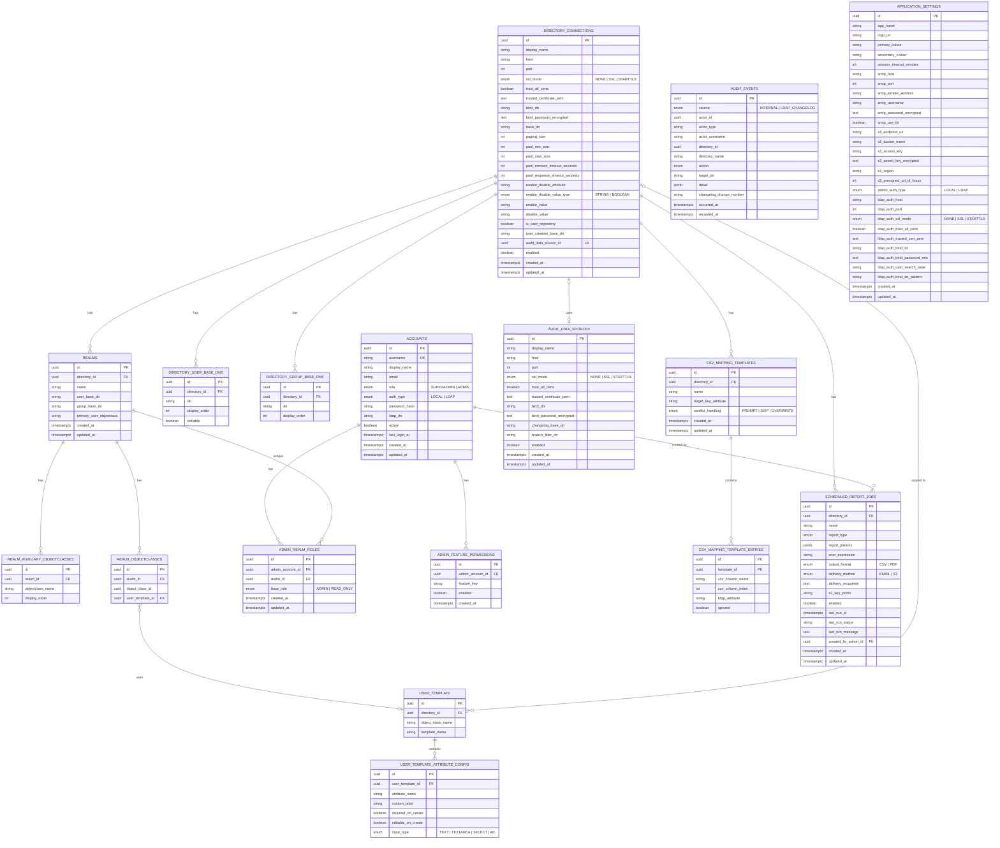

# Database Entity Relationship Diagram

Generated from JPA entity classes in `com.ldapadmin.entity`.

```mermaid
erDiagram
    ACCOUNTS {
        uuid id PK
        string username UK
        string display_name
        string email
        enum role "SUPERADMIN | ADMIN"
        enum auth_type "LOCAL | LDAP"
        string password_hash
        string ldap_dn
        boolean active
        timestamptz last_login_at
        timestamptz created_at
        timestamptz updated_at
    }

    DIRECTORY_CONNECTIONS {
        uuid id PK
        string display_name
        string host
        int port
        enum ssl_mode "NONE | SSL | STARTTLS"
        boolean trust_all_certs
        text trusted_certificate_pem
        string bind_dn
        text bind_password_encrypted
        string base_dn
        int paging_size
        int pool_min_size
        int pool_max_size
        int pool_connect_timeout_seconds
        int pool_response_timeout_seconds
        string enable_disable_attribute
        enum enable_disable_value_type "STRING | BOOLEAN"
        string enable_value
        string disable_value
        boolean is_user_repository
        string user_creation_base_dn
        uuid audit_data_source_id FK
        boolean enabled
        timestamptz created_at
        timestamptz updated_at
    }

    DIRECTORY_USER_BASE_DNS {
        uuid id PK
        uuid directory_id FK
        string dn
        int display_order
        boolean editable
    }

    DIRECTORY_GROUP_BASE_DNS {
        uuid id PK
        uuid directory_id FK
        string dn
        int display_order
    }

    REALMS {
        uuid id PK
        uuid directory_id FK
        string name
        string user_base_dn
        string group_base_dn
        string primary_user_objectclass
        timestamptz created_at
        timestamptz updated_at
    }

    REALM_AUXILIARY_OBJECTCLASSES {
        uuid id PK
        uuid realm_id FK
        string objectclass_name
        int display_order
    }

    REALM_OBJECTCLASSES {
        uuid id PK
        uuid realm_id FK
        uuid object_class_id
        uuid user_template_id FK
    }

    ADMIN_REALM_ROLES {
        uuid id PK
        uuid admin_account_id FK
        uuid realm_id FK
        enum base_role "ADMIN | READ_ONLY"
        timestamptz created_at
        timestamptz updated_at
    }

    ADMIN_FEATURE_PERMISSIONS {
        uuid id PK
        uuid admin_account_id FK
        string feature_key
        boolean enabled
        timestamptz created_at
    }

    USER_TEMPLATE {
        uuid id PK
        uuid directory_id FK
        string object_class_name
        string template_name
    }

    USER_TEMPLATE_ATTRIBUTE_CONFIG {
        uuid id PK
        uuid user_template_id FK
        string attribute_name
        string custom_label
        boolean required_on_create
        boolean editable_on_create
        enum input_type "TEXT | TEXTAREA | SELECT | etc."
    }

    AUDIT_DATA_SOURCES {
        uuid id PK
        string display_name
        string host
        int port
        enum ssl_mode "NONE | SSL | STARTTLS"
        boolean trust_all_certs
        text trusted_certificate_pem
        string bind_dn
        text bind_password_encrypted
        string changelog_base_dn
        string branch_filter_dn
        boolean enabled
        timestamptz created_at
        timestamptz updated_at
    }

    AUDIT_EVENTS {
        uuid id PK
        enum source "INTERNAL | LDAP_CHANGELOG"
        uuid actor_id
        string actor_type
        string actor_username
        uuid directory_id
        string directory_name
        enum action
        string target_dn
        jsonb detail
        string changelog_change_number
        timestamptz occurred_at
        timestamptz recorded_at
    }

    CSV_MAPPING_TEMPLATES {
        uuid id PK
        uuid directory_id FK
        string name
        string target_key_attribute
        enum conflict_handling "PROMPT | SKIP | OVERWRITE"
        timestamptz created_at
        timestamptz updated_at
    }

    CSV_MAPPING_TEMPLATE_ENTRIES {
        uuid id PK
        uuid template_id FK
        string csv_column_name
        int csv_column_index
        string ldap_attribute
        boolean ignored
    }

    SCHEDULED_REPORT_JOBS {
        uuid id PK
        uuid directory_id FK
        string name
        enum report_type
        jsonb report_params
        string cron_expression
        enum output_format "CSV | PDF"
        enum delivery_method "EMAIL | S3"
        text delivery_recipients
        string s3_key_prefix
        boolean enabled
        timestamptz last_run_at
        string last_run_status
        text last_run_message
        uuid created_by_admin_id FK
        timestamptz created_at
        timestamptz updated_at
    }

    APPLICATION_SETTINGS {
        uuid id PK
        string app_name
        string logo_url
        string primary_colour
        string secondary_colour
        int session_timeout_minutes
        string smtp_host
        int smtp_port
        string smtp_sender_address
        string smtp_username
        text smtp_password_encrypted
        boolean smtp_use_tls
        string s3_endpoint_url
        string s3_bucket_name
        string s3_access_key
        text s3_secret_key_encrypted
        string s3_region
        int s3_presigned_url_ttl_hours
        enum admin_auth_type "LOCAL | LDAP"
        string ldap_auth_host
        int ldap_auth_port
        enum ldap_auth_ssl_mode "NONE | SSL | STARTTLS"
        boolean ldap_auth_trust_all_certs
        text ldap_auth_trusted_cert_pem
        string ldap_auth_bind_dn
        text ldap_auth_bind_password_enc
        string ldap_auth_user_search_base
        string ldap_auth_bind_dn_pattern
        timestamptz created_at
        timestamptz updated_at
    }

    %% ── Relationships ────────────────────────────────────────────────────────

    %% Directory structure
    DIRECTORY_CONNECTIONS ||--o{ DIRECTORY_USER_BASE_DNS : "has"
    DIRECTORY_CONNECTIONS ||--o{ DIRECTORY_GROUP_BASE_DNS : "has"
    DIRECTORY_CONNECTIONS |o--o| AUDIT_DATA_SOURCES : "uses"

    %% Realms
    DIRECTORY_CONNECTIONS ||--o{ REALMS : "has"
    REALMS ||--o{ REALM_AUXILIARY_OBJECTCLASSES : "has"
    REALMS ||--o{ REALM_OBJECTCLASSES : "has"
    REALM_OBJECTCLASSES }o--o| USER_TEMPLATE : "uses"

    %% User templates
    USER_TEMPLATE }o--o| DIRECTORY_CONNECTIONS : "scoped to"
    USER_TEMPLATE ||--o{ USER_TEMPLATE_ATTRIBUTE_CONFIG : "contains"

    %% Admin permissions (realm-scoped)
    ACCOUNTS ||--o{ ADMIN_REALM_ROLES : "has"
    REALMS ||--o{ ADMIN_REALM_ROLES : "scopes"
    ACCOUNTS ||--o{ ADMIN_FEATURE_PERMISSIONS : "has"

    %% CSV import templates
    DIRECTORY_CONNECTIONS ||--o{ CSV_MAPPING_TEMPLATES : "has"
    CSV_MAPPING_TEMPLATES ||--o{ CSV_MAPPING_TEMPLATE_ENTRIES : "contains"

    %% Scheduled reports
    DIRECTORY_CONNECTIONS ||--o{ SCHEDULED_REPORT_JOBS : "has"
    ACCOUNTS ||--o{ SCHEDULED_REPORT_JOBS : "created by"
```
