# Schema ERD — Post-Refactor (V1–V17)

> Generated from migrations V1–V17.
> `actor_id` and `directory_id` on `audit_events` are **denormalised** UUIDs
> (no FK constraints) so audit records survive account/directory deletion.

```mermaid
erDiagram

    accounts {
        uuid        id              PK
        varchar     username        UK
        varchar     display_name
        varchar     email
        varchar     role               "SUPERADMIN | ADMIN"
        varchar     auth_type          "LOCAL | LDAP"
        varchar     password_hash      "bcrypt; null for LDAP accounts"
        varchar     ldap_dn            "LDAP auth only"
        boolean     active
        timestamptz last_login_at
        timestamptz created_at
        timestamptz updated_at
    }

    directory_connections {
        uuid        id                              PK
        varchar     display_name
        varchar     host
        integer     port
        varchar     ssl_mode                           "NONE | LDAPS | STARTTLS"
        boolean     trust_all_certs
        text        trusted_certificate_pem
        varchar     bind_dn
        text        bind_password_encrypted             "AES-256-GCM"
        varchar     base_dn
        integer     paging_size
        integer     pool_min_size
        integer     pool_max_size
        integer     pool_connect_timeout_seconds
        integer     pool_response_timeout_seconds
        varchar     enable_disable_attribute
        varchar     enable_disable_value_type          "BOOLEAN | STRING"
        varchar     enable_value
        varchar     disable_value
        uuid        audit_data_source_id            FK "nullable"
        boolean     enabled
        timestamptz created_at
        timestamptz updated_at
    }

    directory_user_base_dns {
        uuid    id              PK
        uuid    directory_id    FK
        varchar dn
        integer display_order
        boolean editable           "write ops allowed in this branch"
    }

    directory_group_base_dns {
        uuid    id              PK
        uuid    directory_id    FK
        varchar dn
        integer display_order
    }

    audit_data_sources {
        uuid        id                      PK
        varchar     display_name
        varchar     host
        integer     port
        varchar     ssl_mode                   "NONE | LDAPS | STARTTLS"
        boolean     trust_all_certs
        text        trusted_certificate_pem
        varchar     bind_dn
        text        bind_password_encrypted     "AES-256-GCM"
        varchar     changelog_base_dn
        varchar     branch_filter_dn
        boolean     enabled
        timestamptz created_at
        timestamptz updated_at
    }

    directory_objectclasses {
        uuid    id                  PK
        uuid    directory_id        FK
        varchar object_class_name
        varchar display_name
        integer display_order
    }

    objectclass_attribute_configs {
        uuid    id                  PK
        uuid    objectclass_id      FK
        varchar attribute_name
        varchar custom_label
        boolean required_on_create
        boolean editable_on_edit
        varchar input_type             "TEXT | TEXTAREA | PASSWORD | BOOLEAN | DATE | DATETIME | MULTI_VALUE | DN_LOOKUP"
        integer display_order
        boolean visible_in_list
    }

    admin_directory_roles {
        uuid        id                  PK
        uuid        admin_account_id    FK
        uuid        directory_id        FK
        varchar     base_role              "ADMIN | READ_ONLY"
        timestamptz created_at
        timestamptz updated_at
    }

    admin_branch_restrictions {
        uuid        id                  PK
        uuid        admin_account_id    FK
        uuid        directory_id        FK
        varchar     branch_dn
        timestamptz created_at
    }

    admin_feature_permissions {
        uuid        id                  PK
        uuid        admin_account_id    FK
        varchar     feature_key            "user.create | user.edit | user.delete | user.enable_disable | user.move | group.manage_members | group.create_delete | bulk.import | bulk.export | reports.run | reports.export | reports.schedule"
        boolean     enabled
        timestamptz created_at
    }

    csv_mapping_templates {
        uuid        id                      PK
        uuid        directory_id            FK
        varchar     name
        varchar     target_key_attribute
        varchar     conflict_handling          "PROMPT | SKIP | OVERWRITE"
        timestamptz created_at
        timestamptz updated_at
    }

    csv_mapping_template_entries {
        uuid    id                  PK
        uuid    template_id         FK
        varchar csv_column_name
        integer csv_column_index
        varchar ldap_attribute
        boolean ignored
    }

    scheduled_report_jobs {
        uuid        id                      PK
        uuid        directory_id            FK
        uuid        created_by_admin_id     FK  "nullable; SET NULL on delete"
        varchar     name
        varchar     report_type                "USERS_IN_GROUP | USERS_IN_BRANCH | USERS_WITH_NO_GROUP | RECENTLY_ADDED | RECENTLY_MODIFIED | RECENTLY_DELETED | DISABLED_ACCOUNTS"
        jsonb       report_params
        varchar     cron_expression
        varchar     output_format              "CSV | PDF"
        varchar     delivery_method            "EMAIL | S3"
        text        delivery_recipients
        varchar     s3_key_prefix
        boolean     enabled
        timestamptz last_run_at
        varchar     last_run_status
        text        last_run_message
        timestamptz created_at
        timestamptz updated_at
    }

    application_settings {
        uuid        id                          PK  "singleton row"
        varchar     app_name
        varchar     logo_url
        varchar     primary_colour
        varchar     secondary_colour
        integer     session_timeout_minutes
        varchar     smtp_host
        integer     smtp_port
        varchar     smtp_sender_address
        varchar     smtp_username
        text        smtp_password_encrypted         "AES-256-GCM"
        boolean     smtp_use_tls
        varchar     s3_endpoint_url
        varchar     s3_bucket_name
        varchar     s3_access_key
        text        s3_secret_key_encrypted         "AES-256-GCM"
        varchar     s3_region
        integer     s3_presigned_url_ttl_hours
        varchar     admin_auth_type                 "LOCAL | LDAP"
        varchar     ldap_auth_host
        integer     ldap_auth_port
        varchar     ldap_auth_ssl_mode              "NONE | LDAPS | STARTTLS"
        boolean     ldap_auth_trust_all_certs
        text        ldap_auth_trusted_cert_pem
        varchar     ldap_auth_bind_dn               "optional service account"
        text        ldap_auth_bind_password_enc     "AES-256-GCM"
        varchar     ldap_auth_user_search_base
        varchar     ldap_auth_bind_dn_pattern       "uid={username},ou=..."
        timestamptz created_at
        timestamptz updated_at
    }

    audit_events {
        uuid        id                          PK
        varchar     source                         "INTERNAL | LDAP_CHANGELOG"
        uuid        actor_id                       "denormalised — no FK"
        varchar     actor_type                     "ADMIN | SUPERADMIN"
        varchar     actor_username                 "denormalised for history"
        uuid        directory_id                   "denormalised — no FK"
        varchar     directory_name                 "denormalised for history"
        varchar     action
        varchar     target_dn
        jsonb       detail
        varchar     changelog_change_number
        timestamptz occurred_at
        timestamptz recorded_at
    }

    %% ── Relationships ──────────────────────────────────────────────────────────

    %% Directory structure
    audit_data_sources          ||--o{     directory_connections           : "polled by"
    directory_connections       ||--o{     directory_user_base_dns         : "user branches"
    directory_connections       ||--o{     directory_group_base_dns        : "group branches"
    directory_connections       ||--o{     directory_objectclasses         : "objectclasses"
    directory_objectclasses     ||--o{     objectclass_attribute_configs   : "attribute configs"

    %% Account permissions (4-dimensional model)
    accounts                    ||--o{     admin_directory_roles           : "directory roles"
    directory_connections       ||--o{     admin_directory_roles           : "scopes"
    accounts                    ||--o{     admin_branch_restrictions       : "branch restrictions"
    directory_connections       ||--o{     admin_branch_restrictions       : "scopes"
    accounts                    ||--o{     admin_feature_permissions       : "feature permissions"

    %% CSV templates
    directory_connections       ||--o{     csv_mapping_templates           : "csv templates"
    csv_mapping_templates       ||--o{     csv_mapping_template_entries    : "entries"

    %% Scheduled reports
    directory_connections       ||--o{     scheduled_report_jobs           : "report jobs"
    accounts                    |o--o{     scheduled_report_jobs           : "created by"
```

